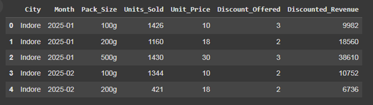
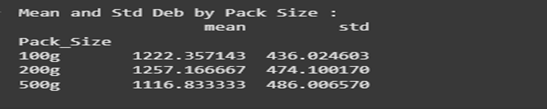
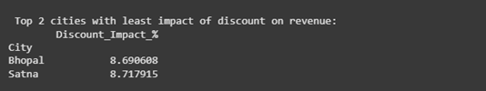

# The Chai Biscuit Mystery – A Taste of Sales Trends

# Introduction
This project analyzes the sales performance of Snackshakti Ltd.'s "Masala Marie" biscuits in Tier-2 cities of India. The goal is to identify which pack size sells best, how discounts affect revenue, and which cities are least impacted by discounts. This analysis helps in making better pricing and promotional decisions.

---

## 2. Dataset Description
- **The dataset was synthetically generated using Python without any CSV import. It contains monthly sales data for 4 Tier-2 cities over 6 months and includes 3 different pack sizes.**
-**Columns:** 
    - `City`: Name of the city 
    - `Month`:Sales month  
    - `Pack_Size`: Biscuit pack size (100g, 200g, 500g) 
    - `Units_Sold`: Number of units sold 
    - `Unit_Price`: Price before discount 
    - `Discount_Offered`: Discount per unit (in ₹) 
    - `Discounted_Revenue`: Revenue after applying discount

---

## 3. Analysis & Calculations
### 3.1 Discounted Revenue Formula
Formula used:

Discounted_Revenue = (Unit_Price - Discount_Offered) * Units_Sold

### 3.2 Mean and Standard Deviation by Pack Size
Calculated average and standard deviation of units sold for each pack size.
 
200g pack has the highest average sales, while 100g has the lowest variation (most consistent).

### 3.3 Most Consistent Pack Size

200g pack size has the most consistent sales (lowest standard deviation), indicating a stable customer base.

### 3.4 Cities with Least Impact of Discount

Compared total revenue with and without discounts to identify top 2 cities with least discount effect.
 
### 3.5 Bar Chart of Pack Size Sales (Optional)

200g packs are the most sold overall, suggesting customers prefer mid-size options.

---

## 4. Insights
Summarize your findings in bullet points.
•	200g packs have the highest average sales across all cities.
•	100g packs show the lowest standard deviation, making them the most consistent.
•	Indore and Satna have the least impact of discounts on revenue.
•	Discounts don't significantly boost revenue in some cities, indicating possible customer loyalty or price insensitivity.
•	500g packs, while larger, may not be as consistently sold, possibly due to higher price sensitivity.

---

## 5. Conclusion
The analysis revealed clear trends in biscuit sales across Tier-2 cities. Among all pack sizes, 200g packs had the highest average sales, while 100g packs were the most consistent in demand. Cities like Indore and Satna showed minimal sensitivity to discounts, which indicates a loyal customer base. These insights can help Snackshakti Ltd. make more informed decisions regarding pricing strategies, promotional offers, and inventory planning in specific regions.
